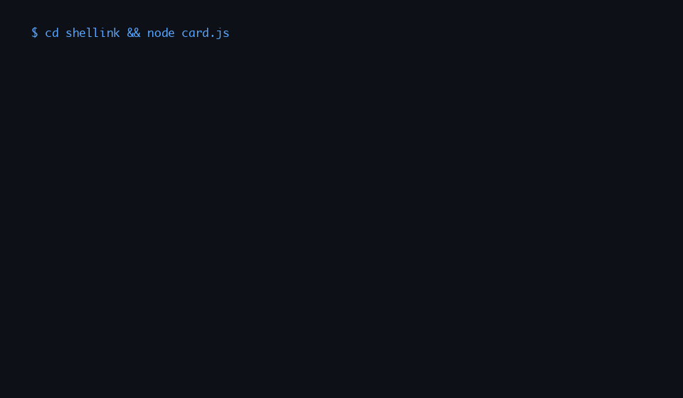

# Shellink

**My introduction from the terminal** — built by [Prithvi S](https://github.com/iprithv).  
One command prints a short intro, then an interactive menu opens links for email, resume, Calendly, portfolio, GitHub, LinkedIn, Google Scholar, and DEV so nobody has to dig through old tabs for how to reach you.

```bash
npx iprithv
```

From this repo:

```bash
git clone https://github.com/iprithv/shellink.git && cd shellink && npm install && node card.js
```

---

### What happens

1. An **intro panel** prints first — copy, color, borders — the handshake before the menu.
2. A **list menu** appears. Choose an action; it runs and the menu **comes back** until you’re finished.
3. **Quit** is the only exit — everything else keeps you in the flow.

---

### Menu at a glance

| Action | What it does |
|--------|----------------|
| Email | Opens your mail client to my gmail address |
| Resume | Copies the bundled PDF `./Prithvi-S.pdf` and opens it (see below for overrides) |
| Calendly | [30‑minute slot](https://calendly.com/prithvisivasankar/30min) |
| Portfolio | Opens the portfolio URL |
| LinkedIn · GitHub · Scholar · DEV blog | Opens the profile and site |

---

### Screenshot



Preview is generated from the real copy and menu labels (see [`scripts/generate_demo_gif.py`](./scripts/generate_demo_gif.py)). To regenerate after you change the intro or menu:

```bash
python3 scripts/generate_demo_gif.py
```

---

### License

Apache License 2.0 — see [`LICENSE`](./LICENSE).
